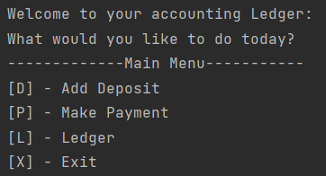
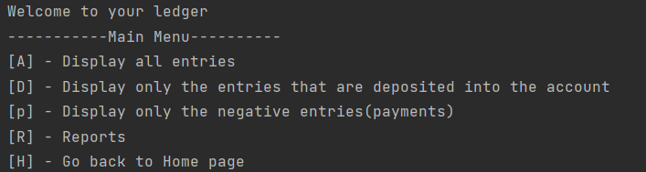
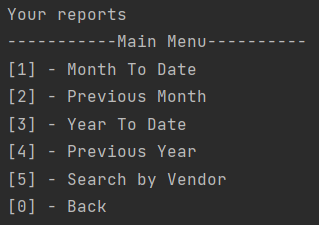

# Accounting Ledger
This is a user-friendly application that allows  users to manage their financial transactions.
They can add Deposit, make Payment or run reports.
This project uses static methods, variables, do-while loop, for loop, switch statements, comparator method and arraylist.
### The application should have the following features:
#### Home Screen:
- Add deposit
- Make payments
- View Ledger
  - Display all entries
  - Display only Deposited entries
  - Display only negative entries
  - Reports
     - Month-to-date
     - Previous Month
     - Year-to-date
     - Previous year
     - Search by vendor
     - Go back
   - Home
- Exit

### Home Screen:

### Ledger Screen:

### Report Menu:
